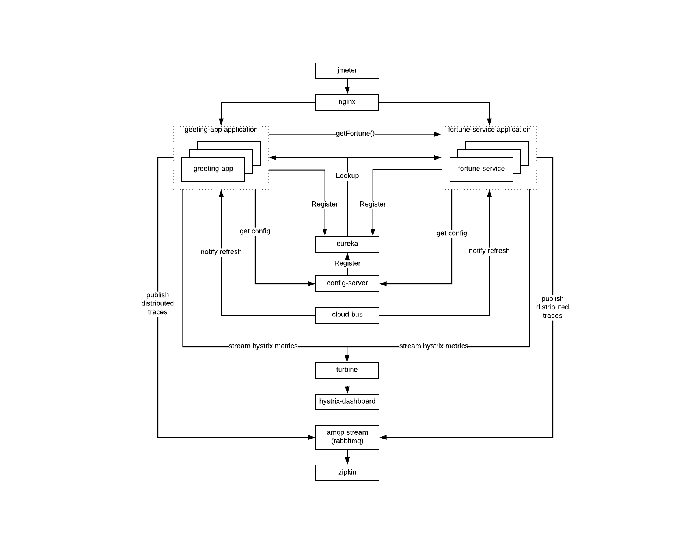

# Spring Cloud Netflix - Failure and Fault Tolerance Demonstrations

## Overview

Spring Cloud Netflix provides component implementations of common patterns to
build distributed systems.

Part of these patterns are used to handle complexities introduced in
distributed systems, such as:

- Bulkheads
- Circuit Breakers
- Timeouts

The scope of this lab is to demonstrate use of Hystrix for bulkheads,
circuit breakers, and *hard* timeouts.

## Objectives

-   Diagnose an application failure pattern
-   Synthesize the following failure mode scenarios
    -   Transient Failures with Exceptions
    -   Transient Failures with Timeout Conditions
        - Hard Timeouts
        - Socket Timeouts
    -   Persistent Failure with Exceptions
    -   Persistent Failure with Timeout Conditions
        - Hard Timeouts
        - Stuck Threads
        - Socket Timeouts
-   Evaluate based from users requirements which fault tolerance
    features should be used:
    -   Circuit Breakers
        - Semaphores
        - Thread Pools
    -   Socket Timeouts and Fast Fail

## Prerequisites

### Knowledge

- Spring, Springboot experience
- Spring Cloud Netflix experience
- Spring Cloud Developer course
- Cloud Native Developer course

### Installations

-   JDK 8
-   Apache Jmeter 3.2 or above
-   Nginx 1.10 or above, configured for load balancing three instances
    of greeting application localhost ports 8080, 8090, 8100
-   RabbitMQ 3.7 or above
-   Git client 2.1 or above

## Failure Modes discussed, demonstrated

-   Exceptions
    - Connection refused
    - Socket connect timeout
    - Socket read timeout
-   Walk Away (Hard) Timeouts
    - Socket timeouts disabled
-   Thread pool depletion
    - Hystrix Command Thread Pool
    - Semaphore from container thread pool

## System Under Test (SUT)



-   Jmeter used for load injection and workload profile modeling
-   Nginx used as reverse proxy / load balancer for Greeting Application
-   Greeting Application
    - REST Controller
    - Actuator enabled
    - Calls downstream Fortune Service through a `RestTemplate`
-   Fortune Service
    - REST Controller
-   Config Server used to allow configuration changes without restart
-   Spring Cloud Bus used to publish Actuator Bus Refresh events
-   Git/github used to source dynamic configuration for Greeting and
    Fortune applications
-   Eureka Server used for discovery lookup
-   Turbine used for hystrix telemetry aggregation
-   Hystrix dashboard used to render Hystrix telemetry data
-   Rabbitmq used to broker AMQP stream data

## Failure Simulation

-   Failure Mode Instrumentation Injection
    -   Induce Failure Modes and Scenarios into either/or/both
        Greeting application or Fortune Service via Aspects
    -   Configuration via defaults and controller servlet
-   Failure simulation:
    -   We simulate persistent failures by 100% request latencies
    -   Downstream Fortune Service bottleneck impact to greeting service
        via load shedding
    -   Circuit Breaker

## Test Injection

-   Jmeter used for load injector
    - Scenarios tunable through command line params
    - UI mode not required, run through headless mode

## Configuration

### Baseline Configuration

The associated configuration for the Config Server sources external
configuration is
[here](../spring-cloud-netflix-oss-ft-demos-config)

Copy the following files to a separate directory on your local machine
*outside* of this repo:

```bash
application.yml
fortune-service.yml
greeting.yml
```

Switch to the new config directory you just creating and generate a
local git repo to maintain and/or experiment with your own versions:

```bash
git init
```

### Configuration Refresh Helper Aliases

Run the following from your forked configuration repo project after
making a change:

-   Commit fortune service config and execute bus refresh:

    ```bash
    alias r-fortune='git commit -a -m"update fortune config"; curl -XPOST http://localhost:8081/bus/refresh'
    ```

-   Commit greeting application config and execute bus refresh:

    ```bash
    alias r-greeting='git commit -a -m"update greeting config"; curl -XPOST http://localhost:8080/bus/refresh'
    ```

### Rest Operation Http Client Timeouts

Note:
The "Ribbon" client timeouts are not dynamically refreshable through
config server, the greeting app must be restarted if either connect or
read timeouts are changed.

## Starting Servers Locally

-   Config Server:
    `CONFIG_REPO_PATH=${YOUR_CONFIG_REPO_PATH} SERVER_PORT=8888 ./gradlew platform-services:config-server:bootRun`
-   Service Registry:
    `SERVER_PORT=8761 ./gradlew platform-services:service-registry:bootRun`
-   Hytrix Dashboard:
    `SERVER_PORT=8586 ./gradlew platform-services:cb-dashboard:bootRun`
-   Turbine:
    `./gradlew platform-services:turbine:bootRun`
-   Zipkin:
    `RABBIT_ADDRESSES=localhost java -jar platform-services/zipkin/zipkin.jar`

-   Greeting Server 0:
    `SERVER_PORT=8080 ./gradlew applications:greeting:bootRun`
-   Greeting Server 1:
    `SERVER_PORT=8090 ./gradlew applications:greeting:bootRun`
-   Greeting Server 2:
    `SERVER_PORT=8100 ./gradlew applications:greeting:bootRun`

-   Fortune Server 0:
    `SERVER_PORT=8081 ./gradlew applications:fortune-service:bootRun`
-   Fortune Server 1:
    `SERVER_PORT=8091 ./gradlew applications:fortune-service:bootRun`
-   Fortune Server 2:
    `SERVER_PORT=8101 ./gradlew applications:fortune-service:bootRun`

-   Start Nginx

    ```bash
    nginx
    ```

-   Starting Jmeter

    ```bash
    jmeter -n -t applications/greeting/src/main/scripts/GreetingHystrixTest.jmx -Jhits=${REQUESTS_PER_MINUTE}
    ```

## [Roadmap](./site/roadmap.md)

## [Hystrix Demonstration](./site/hystrixDemoScript.md)
